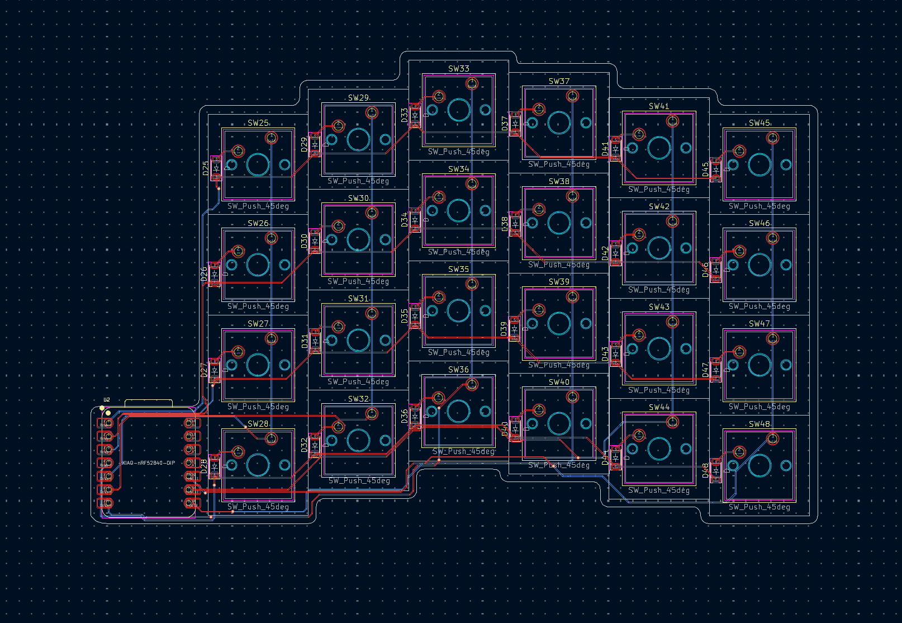
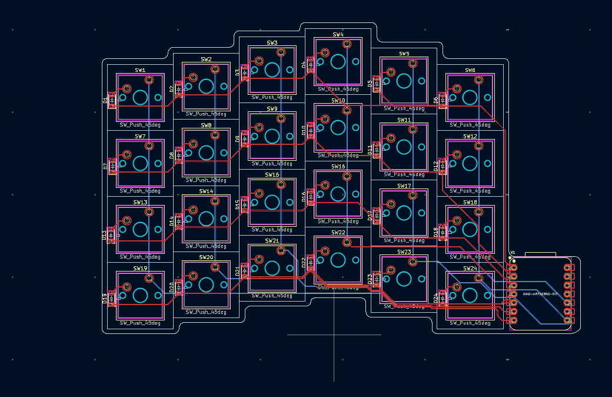
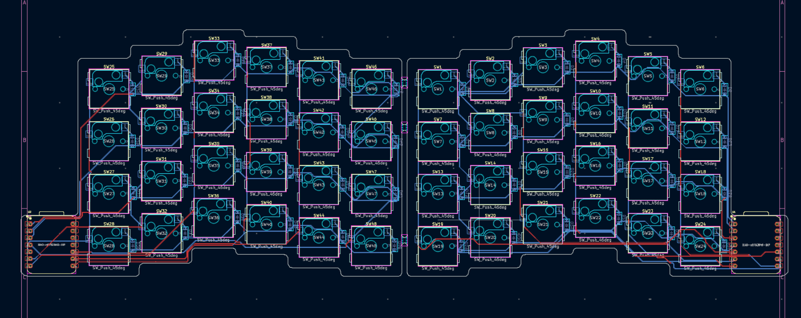
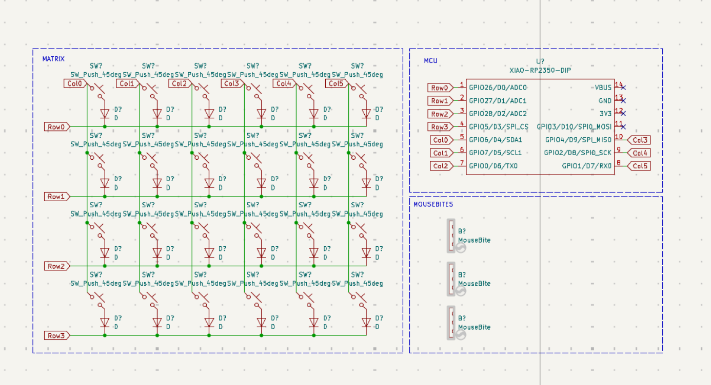
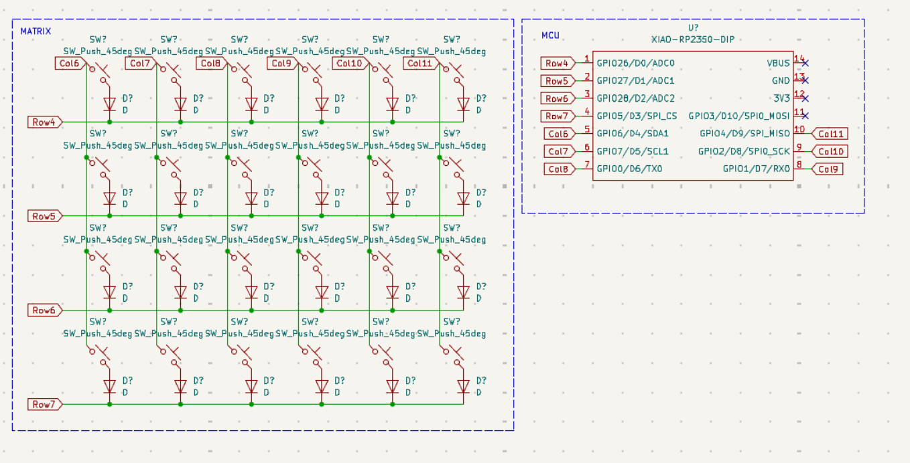
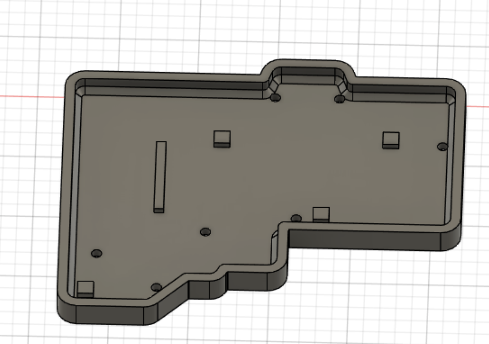
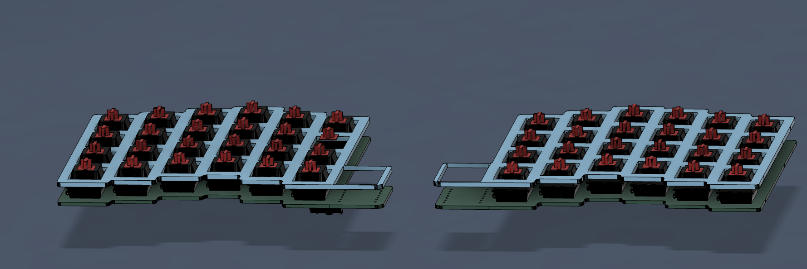

# Splity
A split keyboard for high productivity

This is my low profile split keyboard. I made this because I really wanted to make a keyboard but also didnt want it to be too simple. This is why I made a bluetooth split keyboard. Because of it's small form factor it can "fit" into your pocket. 

## Schematics

## Pcb

## CAD

